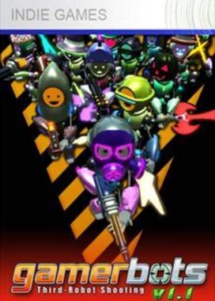

# XBLIG Preservation Project

**Old XNA 360 titles, decompiled and preserved for development and education.**

---

## About

Xbox Live Indie Games (XBLIG) ran on the XNA framework and mostly died with the platform. This project decompiles and rebuilds those titles into buildable, modern-toolchain-friendly source, so the games don't disappear entirely.

## Status Legend

| Icon | Meaning |
| :--: | --- |
| ✅ | Completed |
| 🟡 | In Progress |
| 🔴 | Incomplete / Not started |

## Request List

| Preview | Game | Status | Notes |
| :--: | --- | :--: | --- |
|  | **Flappy Monkey** | ✅ Completed | Buildable source provided |
|  | **HEXOTHERMIC** | 🔴 Incomplete | Requested by [@severetr](https://github.com/severetr) |
|  | **OLU** | 🔴 Incomplete | Requested by [@severetr](https://github.com/severetr) |
|  | **Gamerbots: Third-Robot Shooting** | 🔴 Incomplete | Requested by [@delphinusdown](https://github.com/delphinusdown) |

## Requesting a Game

Open an issue with the game's title, platform confirmation (XBLIG/XNA), and a link or source if you have one. Requests get added to the table above.

## Contributing

Completed entries include buildable source — PRs for fixes, build script improvements, or additional preserved titles are welcome.
